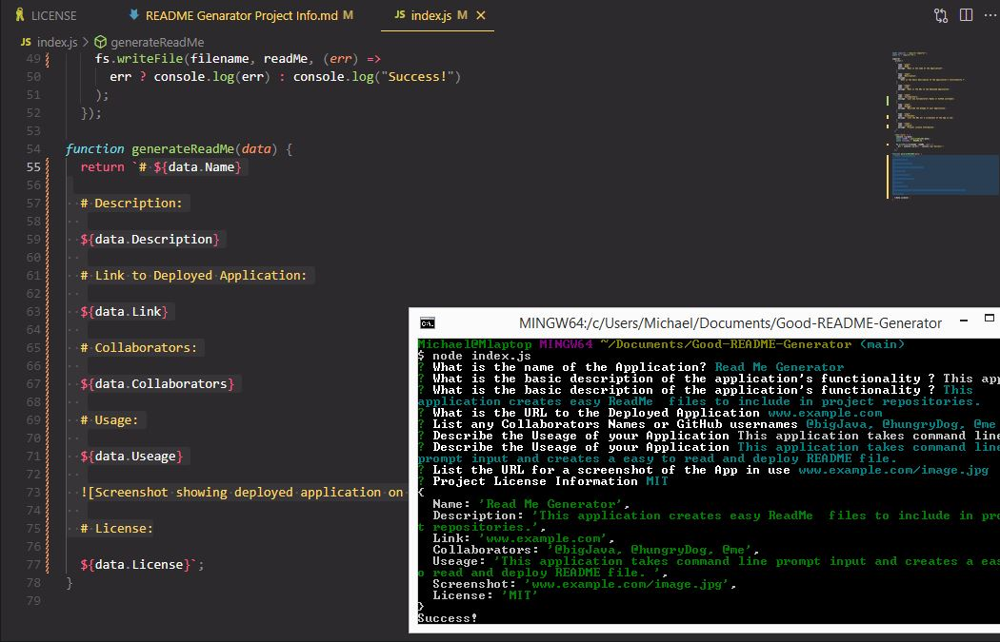

# Good-README-Generator

# Description:

A quick and easy to use generator to make README.md files for user projects and applications. Uses the command line to prompt the user for information related to the project, then presents it in an easy to read and correctly formatted README.md file.

# Link to Runthrough Video:

Since this application is not deployed in a live web asset, we can demonstrate it's functionality in this runthrough video.

https://drive.google.com/file/d/1IluMUKj9YYBB0f35l-4IXP_H4BdHzXnb/view

# Usage:

Upon launching the application, the user is presented with a series of promts to enter the project information. Prompts include: Project title, Description, Link to Deployed Application, Useage, Screenshot, License, Contribution Guidelines, Test Instructions, and Email for Questions.. Once all the information is complete, the application generates a README.md file in the directory that takes the user's input and formats it in Markup correctly to present a well designed README.md document that can be included in the project.

This README Generator meets these Acceptance Criteria:

GIVEN a command-line application that accepts user input
WHEN I am prompted for information about my application repository
THEN a high-quality, professional README.md is generated with the title of my project and sections entitled Description, Table of Contents, Installation, Usage, License, Contributing, Tests, and Questions
WHEN I enter my project title
THEN this is displayed as the title of the README
WHEN I enter a description, installation instructions, usage information, contribution guidelines, and test instructions
THEN this information is added to the sections of the README entitled Description, Installation, Usage, Contributing, and Tests
WHEN I choose a license for my application from a list of options
THEN a badge for that license is added near the top of the README and a notice is added to the section of the README entitled License that explains which license the application is covered under
WHEN I enter my GitHub username
THEN this is added to the section of the README entitled Questions, with a link to my GitHub profile
WHEN I enter my email address
THEN this is added to the section of the README entitled Questions, with instructions on how to reach me with additional questions
WHEN I click on the links in the Table of Contents
THEN I am taken to the corresponding section of the README

# License:

MIT  - https://opensource.org/licenses/MIT

# Citations:

Thanks to Github user Lukas-H for his list of License Badges which can be found at https://gist.github.com/lukas-h/2a5d00690736b4c3a7ba
