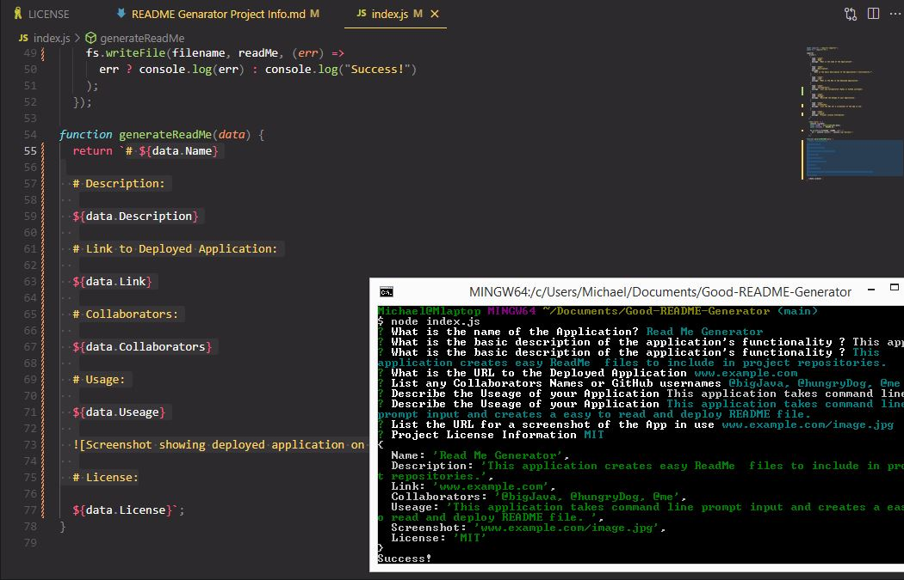

# ReadMe Generator   

  # Description:
  
  Takes user input and generates a README.md file.

  # Link to Deployed Application:
  
  www.example.com

  #Table of Contents
  
  [1. Installation](#installation)

  [2. Useage](#useage)

  [3. License](#license)

  [4. Contribution Guidelines](#contribution-guidelines)

  [5. Tests](#tests)

  [6. Questions](#questions)

  

  # Installation:
  
  1 run node index.js and follow command line prompts.
  
  # Useage:
  
  Takes user input and creates a functional and easy to read README.md file.
  
  
  
  # License:
  
  Eclipse URL: https://opensource.org/licenses/EPL-1.0

  # Contribution Guidelines:

  Email me for details

  # Tests

  Run test files to test functionality

  # Questions?

  mdschenck@example.com

  